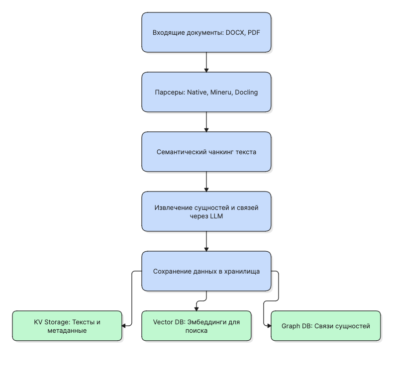
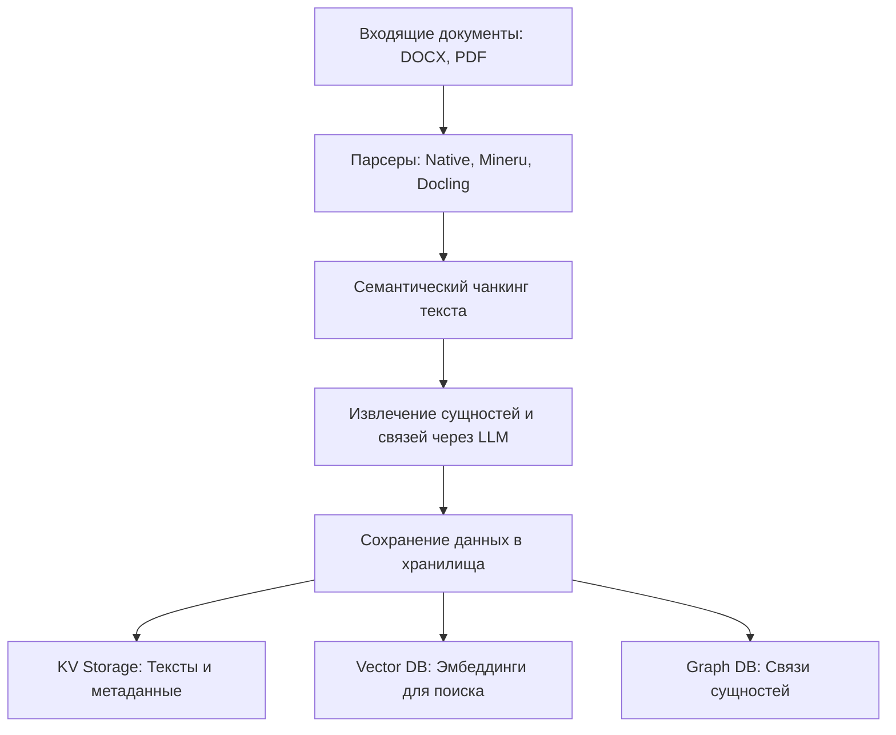
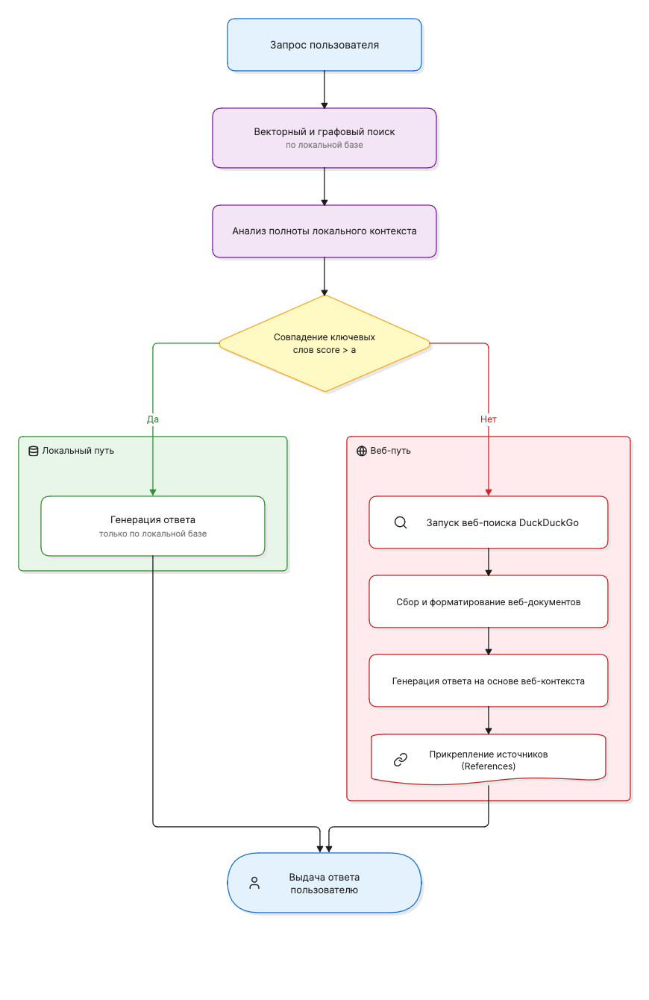
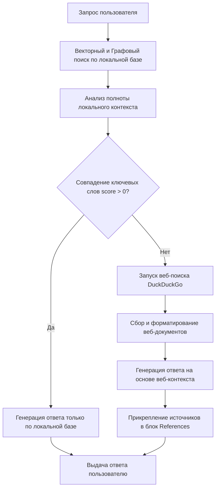

# AlloyRAG: Интеллектуальная система поиска и анализа данных для металлургии и очистки сред

[](https://www.python.org)
[](https://opensource.org/licenses/MIT)
[](https://fastapi.tiangolo.com)
[](https://react.dev)

AlloyRAG — это специализированная программная платформа промышленного класса, предназначенная для семантического поиска, автоматизированного извлечения знаний и интеллектуального анализа технической документации. Система адаптирована под требования металлургической отрасли, горнодобывающей промышленности и процессов очистки технологических сред (водных растворов и промышленных газов).

В основе решения лежит гибридная концепция, объединяющая векторный поиск по текстам, динамические графы знаний (Graph-based Knowledge Graphs) и адаптивный механизм проверки данных через внешние поисковые системы (CRAG-style Web Fallback).

---

## Содержание

1. [Логика решения и архитектура конвейера](#логика-решения-и-архитектура-конвейера)
   - [Конвейер индексации документов (Ingestion Pipeline)](#1-конвейер-индексации-документов-ingestion-pipeline)
   - [Конвейер обработки запросов с веб-поиском (Query Pipeline)](#2-конвейер-обработки-запросов-с-веб-поиском-query-pipeline)
2. [Ключевые преимущества (Киллер-фичи)](#ключевые-преимущества-киллер-фичи)
3. [Стек технологий и системные требования](#стек-технологий-и-системные-требования)
   - [Используемые инструменты и версии](#используемые-инструменты-и-версии)
   - [Аппаратные требования к серверу](#аппаратные-требования-к-серверу)
4. [Инструкция по развертыванию](#инструкция-по-развертыванию)
   - [Развертывание через Docker Compose](#1-развертывание-через-docker-compose)
   - [Локальный запуск для разработки](#2-локальный-запуск-для-разработки)
5. [Подробная конфигурация среды (.env)](#подробная-конфигурация-среды-env)
6. [Экономика токенов и финансовый расчет (TCO)](#экономика-токенов-и-финансовый-расчет-tco)
7. [Сравнение с альтернативными решениями](#сравнение-с-альтернативными-решениями)

---

## Логика решения и архитектура конвейера

Работа системы построена на базе двух независимых конвейеров данных.

### 1. Конвейер индексации документов (Ingestion Pipeline)

Данный конвейер обеспечивает преобразование неструктурированных файлов во взаимосвязанные базы знаний:
1. **Парсинг и извлечение данных**: Входящие файлы (DOCX, PDF, XLSX и др.) обрабатываются специализированными парсерами. На этом этапе сохраняется исходная разметка таблиц и извлекаются метаданные документов.
2. **Семантическое фрагментирование**: Тексты разбиваются на чанки с использованием алгоритмов адаптивной токенизации и абзацного семантического разбиения для исключения потери контекста на границах фрагментов.
3. **Графовая экстракция**: Каждому фрагменту текста сопоставляется LLM-агент, извлекающий сущности (Материалы, Процессы, Оборудование, Свойства) и направленные связи между ними на основе предустановленной отраслевой онтологии.
4. **Синхронизация хранилищ**: Данные сохраняются параллельно в Key-Value хранилище (тексты), векторную базу (семантические эмбеддинги) и графовую СУБД (связи).



<details>
<summary>Mermaid Source (Схема индексации)</summary>



</details>

### 2. Конвейер обработки запросов с веб-поиском (Query Pipeline)

Система реализует подход динамической оценки достаточности знаний на основе скоринга ключевых слов:
1. **Первичный поиск**: Система извлекает векторные окрестности запроса пользователя и пересекающиеся подграфы сущностей из локальной базы знаний.
2. **Скоринг релевантности**: Оценивается плотность совпадения терминов запроса с извлеченным контекстом.
3. **Ветвление**:
   - При **score > $\alpha$**: Используется исключительно локальный контекст базы знаний. Запрос направляется к LLM для генерации ответа.
   - При **score == $\alpha$** (данные в локальной базе полностью отсутствуют): Система активирует модуль интернет-поиска (DuckDuckGo), парсит наиболее релевантные страницы, формирует очищенный веб-контекст, отправляет его в LLM и возвращает ответ со списком проверенных ссылок в стандартном блоке References.



<details>
<summary>Mermaid Source (Схема обработки запросов)</summary>



</details>

---

## Ключевые преимущества (Киллер-фичи)

* **Отраслевой граф онтологий**: Встроенное понимание сущностей технологических цепочек производства (наименования сплавов, флотационных реагентов, типов плавильных печей) и их взаимосвязей (например, концентрация примесей, температурные режимы выщелачивания).
* **Консервативный веб-поиск (CRAG)**: Интернет-поиск подключается строго как последняя линия защиты (при нулевом совпадении с базой данных), что предотвращает утечку конфиденциальных данных и защищает от генерации нерелевантной информации.
* **Параметрический и географический анализ**: Система умеет самостоятельно разграничивать зарубежный опыт от отечественных стандартов и фиксировать точные числовые ограничения (температуры, ПДК, расходы).
* **Автоматическое прикрепление источников**: Веб-ссылки форматируются строго в стандартную разметку References, сохраняя единый стиль интерфейса независимо от источника данных (локальный файл или веб-страница).

---

## Стек технологий и системные требования

### Используемые инструменты и версии

* **Backend**: Python >= 3.10 (рекомендуется 3.11), FastAPI >= 0.108, Uvicorn, Gunicorn
* **Frontend**: React 19.2, TypeScript ~6.0, Vite 8.0, Tailwind CSS 4.0, Bun >= 1.1
* **Векторная БД**: Nano-VectorDB (для локальной работы) или Milvus >= 2.6.2 / PGVector >= 0.4.2 (для продакшена)
* **Графовая БД**: NetworkX (локальный JSON-граф) или Neo4j >= 5.0.0 (для продакшена)
* **Поисковый движок**: DuckDuckGo API (via ddgs >= 9.0)

### Аппаратные требования к серверу

| Профиль развертывания | Минимальные требования (Cloud LLM) | Рекомендуемые требования (Local LLM/VLM) |
|---|---|---|
| **Процессор (CPU)** | 4 Cores (Intel/AMD или Apple Silicon) | 8-16 Cores |
| **Оперативная память (RAM)** | 16 GB | 32-64 GB (с учетом Milvus и Neo4j) |
| **Видеокарта (GPU)** | Не требуется | NVIDIA GPU с поддержкой CUDA (от 16-24 GB VRAM) |
| **Дисковое пространство** | 50 GB SSD | 500+ GB NVMe SSD |

---

## Инструкция по развертыванию

### 1. Развертывание через Docker Compose

Это наиболее быстрый способ запустить готовую инфраструктуру (бэкенд, фронтенд и необходимые базы данных).

```bash
# Копируем пример файла настроек среды
cp env.example .env

# Редактируем параметры доступа в файле .env (укажите API-ключ)
nano .env

# Запуск всех контейнеров в фоновом режиме
docker-compose -f docker-compose-full.yml up -d

# Просмотр логов бэкенда
docker-compose -f docker-compose-full.yml logs -f alloyrag
```

### 2. Локальный запуск для разработки

Для ручного тестирования и модификации кода используйте локальное окружение.

#### Запуск Backend:
```bash
# Инициализация виртуального окружения через uv (рекомендуется)
uv sync --extra api --extra web-search
source .venv/bin/activate

# Запуск бэкенд сервера на порту 9621
uvicorn app:app --host 0.0.0.0 --port 9621 --reload
```

#### Запуск Frontend (WebUI):
```bash
cd alloyrag_webui
bun install --frozen-lockfile
bun run dev
```
Интерфейс разработчика откроется по адресу `http://localhost:5173`.

---

## Подробная конфигурация среды (.env)

| Переменная окружения | Значение по умолчанию | Описание |
|---|---|---|
| `WORKING_DIR` | `./rag_storage` | Путь для сохранения локальных баз и кэша |
| `INPUT_DIR` | `./inputs` | Директория для сканирования входных документов |
| `WEB_SEARCH_FALLBACK_ENABLE` | `false` | Включение механизма веб-поиска при отсутствии локальных данных |
| `WEB_SEARCH_CONFIDENCE_THRESHOLD`| `0.3` | Порог уверенности (не используется при жестком отсечении score == 0) |
| `WEB_SEARCH_MAX_RESULTS` | `5` | Максимальное число веб-ссылок, используемых для контекста |
| `LLM_BINDING` | `ollama` | Провайдер LLM (принимает значения: `openai`, `ollama`) |
| `LLM_BINDING_HOST` | `http://localhost:11434` | Адрес API-хоста провайдера моделей |
| `LLM_BINDING_API_KEY` | `ollama` | API-ключ доступа к модели (для VseGPT или OpenAI) |
| `LLM_MODEL` | `qwen2.5:7b-instruct` | Модель для генерации ответов |

---

## Экономика токенов и финансовый расчет (TCO)

Расчет стоимости эксплуатации основан на тарифах провайдера VseGPT для модели `openai/gpt-4o-mini` (базовые тарифы: Входные токены — $0.15 / 1 млн токенов, Выходные токены — $0.60 / 1 млн токенов).

### 1. Этап индексации (Ingestion)
При добавлении документов основные затраты приходятся на извлечение сущностей и связей (Extraction).
* Средний размер одного текстового фрагмента (чанка): 1500 символов (~350 токенов).
* На каждый чанк выполняется 1 запрос к LLM для выделения сущностей и 1 запрос для построения связей.
* Средний размер промпта экстракции: 2000 токенов.
* Средний размер ответа LLM с JSON-структурой сущностей: 500 токенов.

**Затраты на 100 страниц текста (~300 чанков):**
* Входные токены: `300 чанков * 2000 токенов = 600,000 токенов` ($0.09)
* Выходные токены: `300 чанков * 500 токенов = 150,000 токенов` ($0.09)
* **Итоговая стоимость индексации 100 страниц:** ~$0.18 (около 16 рублей по текущему курсу).

### 2. Этап генерации ответов (Query)
* Средний размер поискового запроса пользователя: 20 токенов.
* Локальный контекст (найденные чанки + сущности графа): ~4000 токенов.
* Контекст из интернета (при переключении на веб-поиск): ~6000 токенов.
* Средний объем сгенерированного ответа: 500 токенов.

**Затраты на 100 поисковых запросов пользователей:**
* *Сценарий А: Ответ полностью из локальной базы знаний (без веб-поиска):*
  - Входные токены: `100 * 4000 = 400,000 токенов` ($0.06)
  - Выходные токены: `100 * 500 = 50,000 токенов` ($0.03)
  - **Итого за 100 локальных запросов:** ~$0.09 (около 8 рублей).
* *Сценарий Б: Ответ полностью из интернета (веб-поиск активен):*
  - Входные токены: `100 * 6000 = 600,000 токенов` ($0.09)
  - Выходные токены: `100 * 500 = 50,000 токенов` ($0.03)
  - **Итого за 100 веб-запросов:** ~$0.12 (около 11 рублей).

---

## Сравнение с альтернативными решениями

| Критерий оценки | Классический Naive RAG | Microsoft GraphRAG | Наше решение (AlloyRAG + Web) |
|---|---|---|---|
| **Полнота ответов на сложные вопросы** | Низкая (ищет только куски текста) | Высокая (строит глобальные саммари) | Высокая (использует локальный граф связей) |
| **Устойчивость к отсутствию данных** | Нулевая (молчит или галлюцинирует) | Нулевая (выдает ошибку отсутствия данных) | Абсолютная (автоматически ищет в интернете) |
| **Сложность развертывания** | Минимальная | Высокая (требует сложной настройки графа) | Средняя (встроенный докер-компоуз, автонастройка) |
| **Защита от утечки данных в веб** | Полная (локальный контур) | Полная (локальный контур) | Управляемая (веб-поиск включается только при score == 0) |
| **Стоимость токенов (Ingestion)** | Низкая | Сверхвысокая | Оптимальная (точечная экстракция) |
