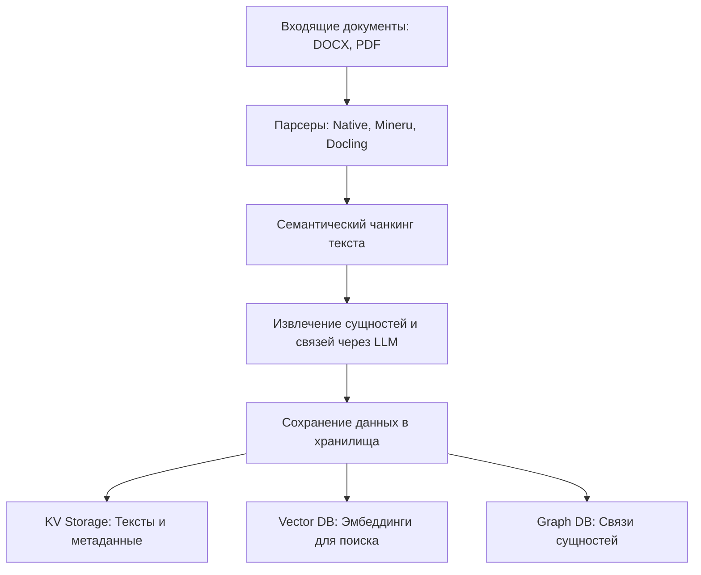
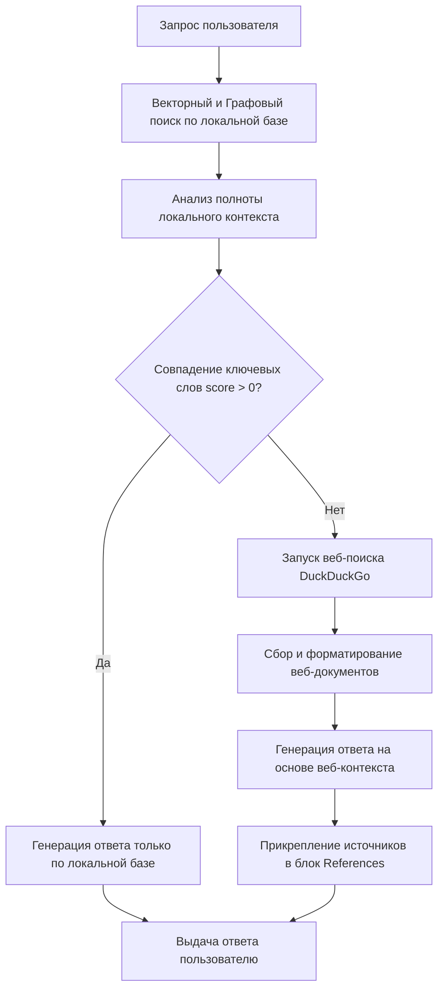

# AlloyRAG: Интеллектуальная система поиска и анализа данных для металлургии и очистки сред

AlloyRAG — это специализированная программная платформа, предназначенная для семантического поиска, анализа технической документации и извлечения знаний в металлургической отрасли, горнодобывающей промышленности и области очистки газов и воды. 

Платформа выходит за рамки классического RAG (Retrieval-Augmented Generation), объединяя векторный поиск, графы знаний и динамическую верификацию через интернет для предоставления точных, структурированных и фактологически обоснованных ответов.

## Логика решения (Архитектура конвейера)

Система разделена на два ключевых процесса: конвейер индексации документов (Ingestion Pipeline) и конвейер обработки запросов (Query Pipeline).

### 1. Конвейер индексации документов (Ingestion Pipeline)

Процесс обработки входящих файлов включает следующие этапы:
1. **Маршрутизация и парсинг**: Файлы различных форматов (DOCX, PDF и др.) классифицируются и обрабатываются специализированными парсерами (Native, Mineru, Docling). На этом этапе извлекаются не только тексты, но и таблицы и изображения.
2. **Семантический чанкинг**: Текст разбивается на смысловые фрагменты (чанки) с использованием адаптивных стратегий (токенизация, рекурсивное разбиение, абзацный семантический чанкинг).
3. **Извлечение сущностей и связей (LLM Extraction)**: Модель анализирует каждый фрагмент текста и извлекает сущности по специализированной онтологии (Материалы, Процессы, Оборудование, Свойства, Эксперименты, Эксперты и др.), а также связи между ними (например, процесс использует материал, процесс дает на выходе свойство).
4. **Запись в хранилища**:
   - Текст чанков и метаданные документов сохраняются в Key-Value хранилище.
   - Векторные представления (эмбеддинги) сущностей и текстов сохраняются в Векторную БД.
   - Граф связей между сущностями импортируется в Графовую БД.



### 2. Конвейер обработки запросов с веб-поиском (Query Pipeline)

Обработка запроса пользователя происходит по гибридному сценарию с автоматическим контролем полноты локальных данных (CRAG-style Web Fallback):
1. **Локальный поиск**: Запрос пользователя преобразуется в эмбеддинг. Выполняется векторный поиск по текстам и сущностям, а также извлекается соответствующая подсеть графа знаний.
2. **Оценка релевантности контекста**: Система рассчитывает показатель перекрытия ключевых слов (score) локального контекста с текстом запроса.
3. **Логика ветвления**:
   - Если **score > 0.0** (в базе есть релевантная информация): Запрос обрабатывается исключительно на основе локальной базы знаний через LLM. Интернет-поиск не используется.
   - Если **score == 0.0** (в локальной базе знаний информация отсутствует полностью):
     - Запускается поисковый модуль (DuckDuckGo Search) для сбора данных из открытых источников.
     - Результаты поиска форматируются, очищаются и формируют веб-контекст.
     - LLM генерирует ответ на основе веб-контекста.
     - В конец сгенерированного ответа автоматически добавляется структурированный блок со ссылками на использованные веб-ресурсы в формате References.



## Ключевые преимущества (Киллер-фичи)

1. **Отраслевая графовая онтология**: Система настроена на извлечение специфических химико-технологических понятий (концентрации, составы растворов, температурные режимы, типы плавильных печей) и связей между ними. Это позволяет строить связные цепочки зависимостей вида "Сырье -> Процесс -> Промежуточный продукт -> Оборудование -> Выходной металл".
2. **Динамический гибридный поиск (Hybrid Retrieval)**: Сочетание векторного поиска по текстам с обходом локального графа знаний гарантирует, что система найдет не только похожие слова, но и семантически связанные концепты, находящиеся в разных документах.
3. **Интеллектуальный веб-откат (CRAG Fallback)**: Система умеет определять границы собственного знания. При получении запроса, выходящего за рамки локальной базы (например, стоимость акций, новости или внешние стандарты), система автоматически достраивает контекст через интернет-поиск, предотвращая галлюцинации LLM.
4. **Географическое и параметрическое разделение**: При обработке данных система автоматически классифицирует технологии на отечественную практику (РФ) и зарубежную практику (импортные аналоги), а также извлекает и сопоставляет численные ограничения и лимиты (например, предельно допустимые концентрации).
5. **Многоуровневое логирование и мониторинг**: Все шаги прохождения запроса, оценки скора, переключения на веб-поиск и генерации фиксируются в системе логирования для последующего аудита качества ответов.

## Сравнение с аналогами

| Параметр сравнения | Стандартный Naive RAG | Microsoft GraphRAG | Наше решение (AlloyRAG + Web) |
|---|---|---|---|
| **Учет связей между терминами** | Нет (только поиск по схожести ключевых слов) | Да (через глобальный граф сущностей) | Да (через локальный граф сущностей и связей) |
| **Поведение при отсутствии данных** | Выдает пустой ответ или галлюцинирует | Выдает пустой ответ или отказ | Переключается на веб-поиск и находит актуальные данные |
| **Специализация на производстве** | Отсутствует (универсальный поиск) | Отсутствует (требует долгой настройки промптов) | Глубокая встроенная онтология для металлургии и экологии |
| **Анализ таблиц и схем** | Низкое качество (теряет структуру) | Среднее качество (зависит от парсера) | Высокое качество (благодаря интеграции Docling/Mineru) |
| **Стоимость эксплуатации** | Низкая | Очень высокая (требует огромного числа LLM-запросов к графу) | Оптимальная (точечные запросы к локальному контексту) |

## Развертывание и конфигурация

### Настройка окружения (.env)

Основные переменные для настройки веб-поиска и языковой модели в файле `.env`:

```env
# Включение функции веб-поиска при отсутствии локальных данных
WEB_SEARCH_FALLBACK_ENABLE=true
WEB_SEARCH_CONFIDENCE_THRESHOLD=0.3
WEB_SEARCH_MAX_RESULTS=5

# Настройка интеграции с VseGPT
LLM_BINDING=openai
LLM_BINDING_HOST=https://api.vsegpt.ru/v1
LLM_BINDING_API_KEY=ваш_api_ключ
LLM_MODEL=openai/gpt-4o-mini
```

### Запуск системы

Запуск всех сервисов (базы данных, API-сервер, веб-интерфейс) в Docker-контейнерах:

```bash
docker-compose -f docker-compose-full.yml down
docker-compose -f docker-compose-full.yml up -d
```
